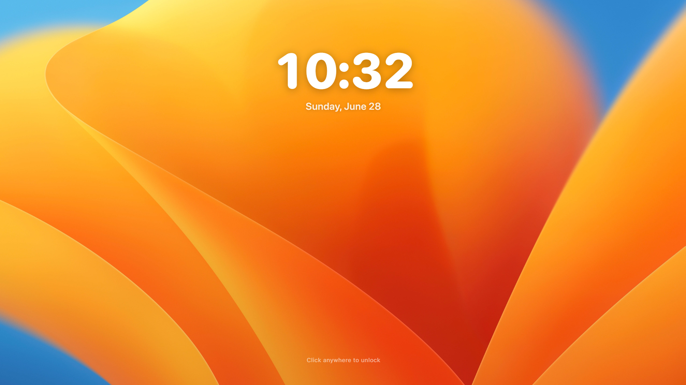
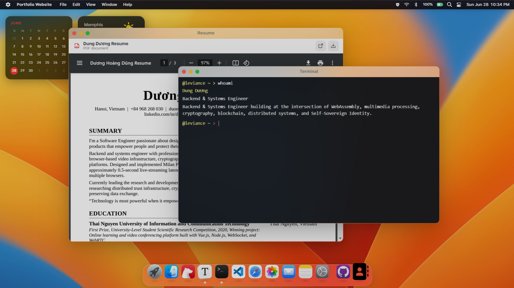
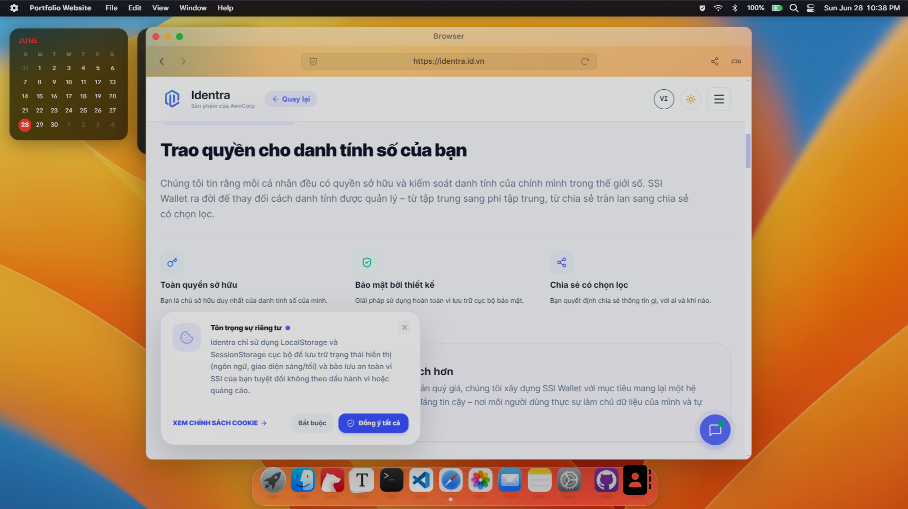
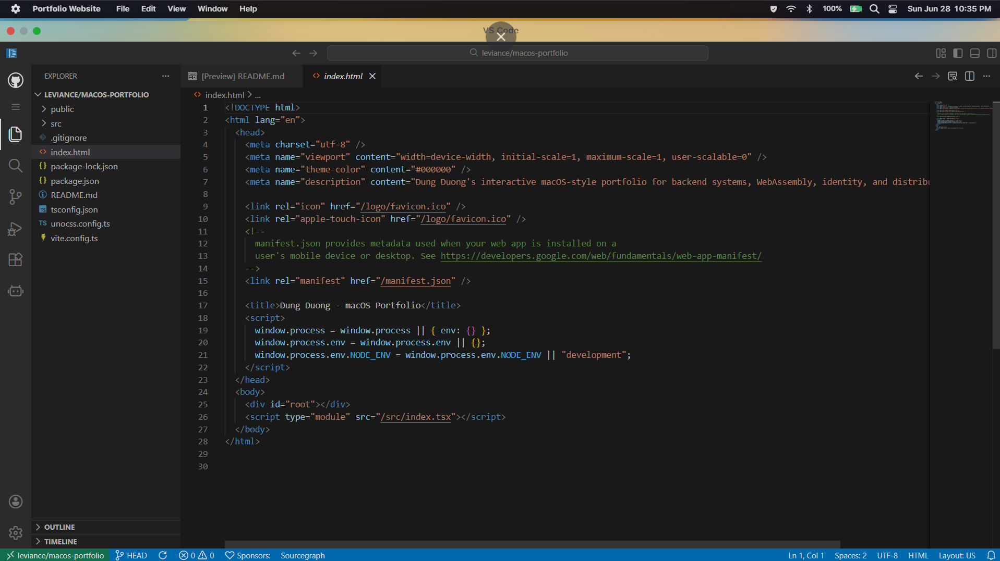

# DungOS - macOS Portfolio

A macOS Ventura-inspired portfolio website for Dung Dương, a Backend & Systems Engineer. Instead of presenting a static resume page, DungOS lets visitors explore the profile as if they were using a small operating system: opening Resume, Terminal, Finder, VS Code Viewer, Browser, Notes, Photos, Contact, and project case studies.

## Overview

DungOS is a desktop-first interactive portfolio for recruiters and technical reviewers. The content focuses on backend systems, WebAssembly, multimedia processing, cryptography, distributed systems, blockchain, and Self-Sovereign Identity.

Core profile:

- Name: Dung Dương
- Role: Backend & Systems Engineer
- GitHub: [github.com/leviance](https://github.com/leviance)
- LinkedIn: [linkedin.com/in/dũng-dương-95578a208](https://www.linkedin.com/in/d%C5%A9ng-d%C6%B0%C6%A1ng-95578a208/)
- Email: [duongdung12a8@gmail.com](mailto:duongdung12a8@gmail.com)

## Screenshots

| Login Screen | Desktop Home |
|---|---|
|  |  |

| Safari Browser | VS Code Viewer |
|---|---|
|  |  |

## Features

- macOS Ventura-inspired desktop shell with lock screen, login flow, wallpaper, menu bar, dock, widgets, and draggable windows.
- Default desktop opens Resume and Terminal, positioned left and right for a fast first impression.
- Resume app renders the real `public/resume.pdf`.
- Terminal app supports curated portfolio commands such as `help`, `whoami`, `skills`, `experience`, `projects`, `hobbies`, `goals`, `care`, `contact`, `open`, `lang`, `ls`, `cd`, `cat`, and `clear`.
- Finder and Project Notes expose spotlight projects, public repositories, and case-study-only projects without fake source links.
- VS Code Viewer links public repositories to `vscode.dev` / GitHub-oriented source exploration.
- Browser, Photos, Notes, Contact, Settings, GitHub, and LinkedIn shortcuts complete the desktop metaphor.
- User interface preferences are persisted with cookie-first storage and localStorage fallback.
- Desktop-focused experience with a mobile/tablet fallback path.

## Spotlight Projects

- Milan Player: browser video player work around FFmpeg, WebAssembly, Canvas, FLV/HLS playback, A/V sync, and content protection.
- SSI Vietnamese Translation: terminology and research work around Self-Sovereign Identity, DID, Verifiable Credentials, and trust frameworks.
- Identra: open-source identity wallet product concept.
- CertNet: hybrid blockchain and trust infrastructure architecture concept.
- SCH - Smart Contract Hosting: smart contract hosting and verification concept.
- AI Trust Agent: research direction for trust, credentials, and AI-assisted user agency.
- Audio Worklet Loader: public repository for browser audio/runtime tooling.
- WebAssembly / FFmpeg Lab: grouped systems-learning work around FFmpeg, C/C++, WebAssembly, and Emscripten.
- Data Compression: systems/math-oriented public repository.
- Pinet / Pinet Vue and Uni.js: messaging and framework-internals learning projects.

## Tech Stack

- React 18
- Vite 5
- TypeScript
- Zustand
- Framer Motion
- React RND
- UnoCSS / Iconify
- React Markdown, KaTeX, and syntax highlighting utilities

## Getting Started

Requirements:

- Node.js 18+ recommended
- npm or pnpm

Install dependencies:

```bash
npm install
```

Run the local development server:

```bash
npm run dev
```

The dev server binds to `127.0.0.1`. Vite will print the local URL, usually:

```text
http://127.0.0.1:5173
```

Build for production:

```bash
npm run build
```

Preview the production build:

```bash
npm run serve
```

Run lint:

```bash
npm run lint
```

## Project Structure

```text
public/
  markdown/           Markdown content used by profile/document apps
  img/                Icons, UI assets, wallpapers, and avatar
  resume.pdf          Real resume rendered by the Resume app

src/
  components/         Desktop shell, apps, dock, menu bar, widgets
  configs/            App registry, portfolio data, terminal tree, websites
  stores/             Zustand store slices and persisted settings
  styles/             Global styles and macOS-like surfaces
  utils/              Window constants, fullscreen helpers, settings storage
```

## Content Source

Portfolio content is centralized mostly in:

- `src/configs/portfolio.ts`
- `src/configs/terminal.tsx`
- `src/configs/bear.tsx`
- `src/configs/websites.ts`
- `public/markdown/*`
- `public/resume.pdf`

When updating profile data, prefer editing these source files instead of hardcoding copy inside app components.

## Interaction Notes

- The lock screen appears first. Clicking Sign In requests fullscreen and waits briefly before showing the desktop to avoid visual jank.
- Dock z-index is intentionally dynamic: it stays below windows normally, then rises above windows only while hovered or focused.
- Spotlight is a system-level overlay and always appears above open windows.
- `vscode.dev` is opened externally instead of iframed because VS Code Web blocks embedding with frame restrictions.
- Case-study projects without public source do not show fake source links.

## Deployment

This is a static Vite app and can be deployed to Vercel, Netlify, GitHub Pages, or any static hosting provider.

Typical build output:

```text
dist/
```

For Vercel or Netlify, use:

- Build command: `npm run build`
- Output directory: `dist`

## Known Build Warnings

The app may emit UnoCSS/Iconify warnings for a few legacy icon class names and a Vite chunk-size warning. These warnings do not currently block production builds.

## License

This portfolio contains personal identity, resume, and project content for Dung Dương. Reuse the engineering approach freely, but replace personal content, links, resume, and images before using it for another person.
